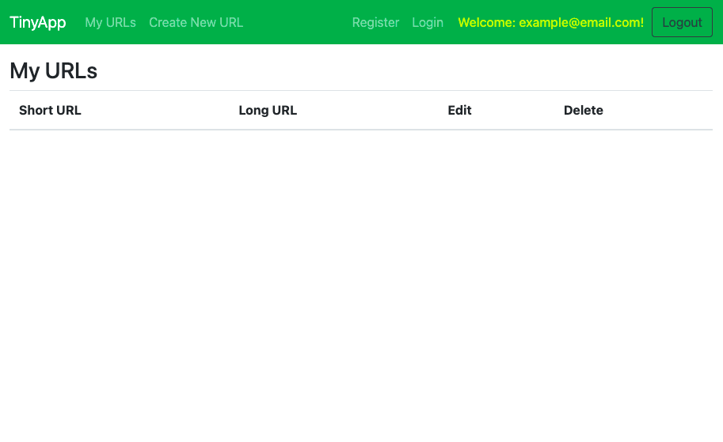
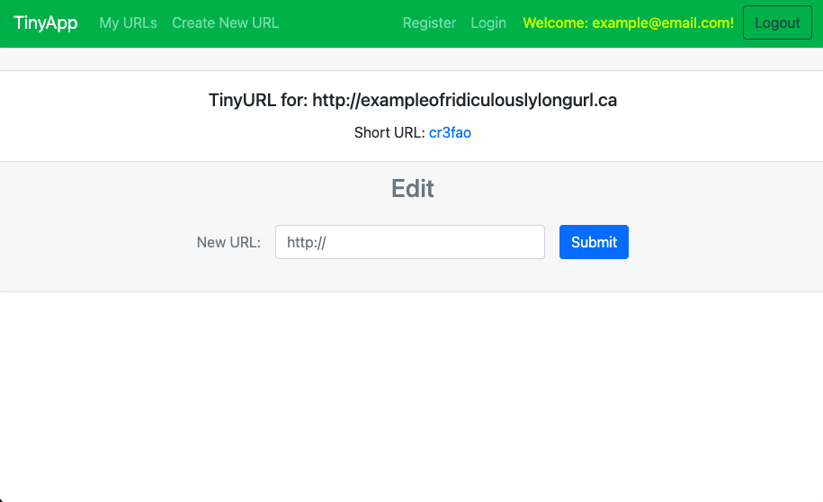
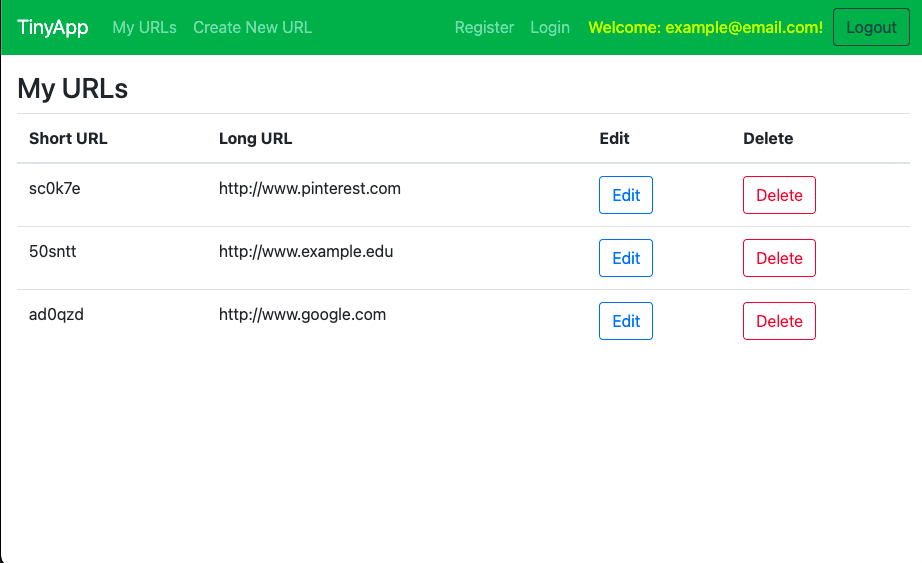

# TinyApp Project

TinyApp is a full stack web application built with Node and Express that allows users to shorten long URLs (à la bit.ly).

## Final Product

***
Here we can see the "Create Account" page:

***
Here we have the login page, in case you already created an account:

***
Once logged in, you are able to see all your shortened URLs. (Is the page blank? Let's press "Create New URL" in the top-left corner and create new shortened URL!):

***
Here take any URL you want, paste it in the form and press "Submit":

***
Once we have the shortened URL, we can either press on the short URL which redirects us to the proper website, or simply return to the main page:

***
Here on the main page we can see all our shortened URLs:

***

## Dependencies

- Node.js
- Express
- EJS
- bcrypt
- body-parser
- cookie-session

## Getting Started

- Install all dependencies (using the `npm install` command).
- Run the development web server using the `node express_server.js` command.